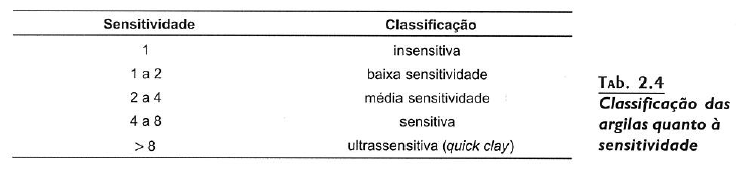
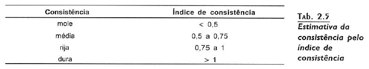

# Argilas

 - **Consistência**
     - A argila apresenta um comportamento diferente da areia e costuma ser caracterizada em função da [resistência á compressão simples](resistencia_a_compressao_simples.md)
     - 
     - A consistência das argilas após manuseadas, pode ser menor que a das argilas em estado natural, tal fenômeno recebe o nome de "sensitividade da argila"
         - Depende da formação argilosa
 - A sensitividade pode ser obtida como
     - S = Resistência no estado indeformado/Resistência no estado amalgamado
     - 
     - A sensitividade é atribuída à estrutura obtida no processo de sedimentação
     - Sensitividade de argilas = Índice de estrutura
 - **Índice de Consistência**
     - As argilas frequentemente se encontram saturadas porém, somente a umidade não é capaz de traduzir o comportamento das argilas
     - A consistência das argilas se comporta de maneira relativa aos Limites de Liquidez e Plasticidade
         - Regressão linear
     - O índice de consistência é calculado como:
         - IC = (LL - _w_)/(LL - LP)
     - 

## Referência

 - [Curso Básico de Mecânica dos Solos](curso_basico_de_mecanica_dos_solos.md)

## Conecta

 - !%Filho[Solos](solos.md)
