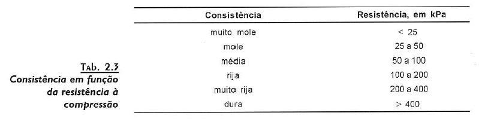

# Argilas

 - **Consistência**
     - A argila apresenta um comportamento diferente da areia e costuma ser caracterizada em função da [resistência á compressão simples](resistencia_a_compressao_simples.md)
     - 
