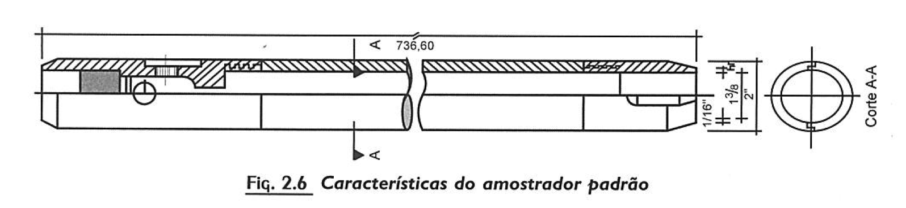
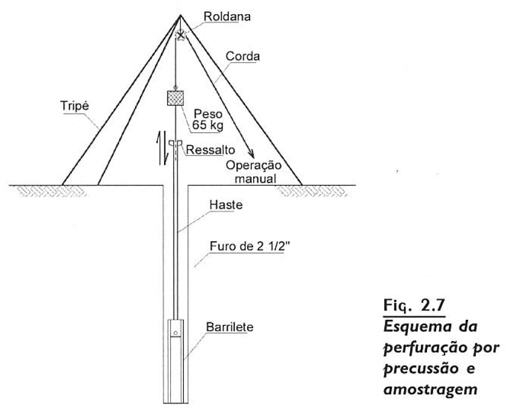

# Prospecção do subsolo
 - Em projetos de engenharia, diversas técnicas são empregadas:
     - Sondagens de Simples Reconhecimento (perfuração e amostragem)
         - Segue a regra da ABNT NBR-6484
	 - **Perfuração acima do Nível d'água**
	     - Iniciada com trado tipo cavadeira, usando-se o diâmetro de 10 cm.
	     - O material é coletado para classificação quanto a sua composição.
	     - Amostragem costuma ser feita de metro a metro ou na mudança de material
	     - Atingida certa profundidade, introduz-se um tubo de revestimento de 2,5"
	     - Dentro do tubo a perfuração progride com o trado espiral
	 - **Determinação do nível d'água**
	     - A perfuração a trado é mantida até que seja percebida água no interior do tubo
	     - Neste momento registra-se a cota da água 
	     - Cessado os trbalhos, o nível da água se estabilizará, anota-se também este nível de água
	         - A diferença de cotas significa que a água estava sob pressão.
	     - Deve-se ter atenção aos lençóis suspensos e anotar sua existência.
	 - **Perfuração abaixo do nível d'água**
	     - Emprega-se a técnica de _percussão e lavagem_
		     - "Uma bomba d'água motorizada  injeta água na extremidade inferior do furo, através de uma haste de menor diâmetro, associado a um trépano com a ponta afiada.
			 - A haste é levantada e dexada cair de cerca de 30 cm.
			 - De metro em metro, ou sempre que se notar a alteração do solo pelso detritos carreados, deve'se suspender a operação e realizar uma amostragem.
			 - Perfuração com lavagem (somente empregada abaixo do nível d'água) é mais rápida que a trado.
	 - **Amostragem**
	     - Utiliza-se amostrador padrâo.
		 - Durante a amostragem, procede-se o ensaio de [SPT](spt.md).
		 - 
		 - Diametro interno de 34,9 mm com uma extremidade cortante e a outra ligada a haste, que será golpeada por peso de 65 KG (martelo) por uma altura de 75 cm para a cravação do amostrador.
		 - 

	 - **Apresentação dos resultados**
	 

## Referencia
 - [Curso Básico de Mecânica dos Solos](curso_basico_de_mecanica_dos_solos.md)

## Conecta
 - !%Filho[Solos](solos.md)
