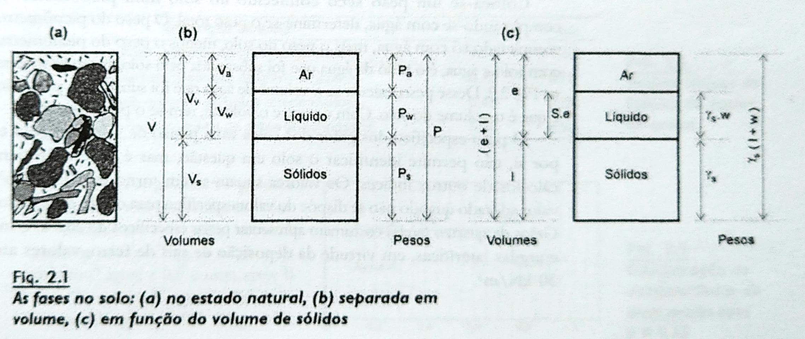

# Solos

 - Somente parte do volume total do solo é ocupado por partículas sólidas.
     - O restante do volume, chamado de espaço vazio é na verdade ocupado por ar ou líquidos.
 - Diz-se que o solo é constituído por 3 fases: partículas sólidas, água e ar.
 - O seu comportamento depende da proporção entre as 3 fases.

 - 

 - Diversos índices são usados na caracterização dos solos, dentre eles:
     - [Umidade](umidade.md)
     - [Índice de Vazios](indice_de_vazios.md)
     - [Porosidade](porosidade.md)
     - [Grau de Saturação](grau_de_saturacao.md)
     - [Peso Específico dos Sólidos (ou dos grãos)](peso_especifico_dos_solidos.md)
     - [Peso Específico da Água](peso_especifico_da_agua.md)
     - [Peso Especifico Natural](peso_especifico_natural.md)
     - [Peso Específico Aparente Seco](peso_especifico_aparente_seco.md]
     - [Peso Específico Aparente Saturado](peso_especifico_aparente_saturado.md)
     - [Peso Específico Submerso](peso_especifico_submerso.md)

 - **Identificação tátil-visual**
     - Dependem da experiência pessoal do profissional
     - Testes:
         - Reistência a seco: fazendo-se uma pelota e deixando secar ao sol, e em seguida, quebrando-a é possível distinguir a fração silte da argilosa (caso em que fica muito dura)
	 - Shaking test: ao se formar uma pasta (saturada) o manuseio e a pressão da mesma, se composta da fração silte, liberam água e, o mesmo não ocorre com a fração argila.
	 - Ductilidade: Ao se manusear o solo perto do limite de plasticidade, as argilas apresentam-se mais resistentes que o silte
	 - Velocidade de secagem: a velocidade de secagem do solo do LL ao LP na mão é relativa ao índice de plasticidade (quanto mais rápida, menor o índice de plasticidade).

## Referência

 - [Curso Básico de Mecânica dos Solos](curso_basico_de_mecanica_dos_solos.md)

## Conecta

 - !%filho[Mecânica dos Solos](mecanica_dos_solos.md)

