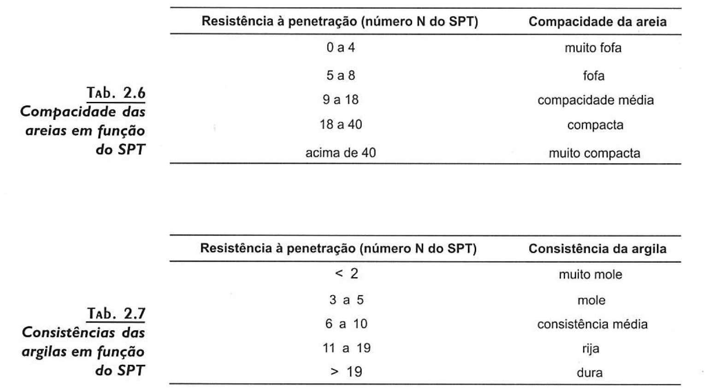

# SPT (_Standard Penetration Test_)
 - Padronizado pela ABNT - NBR 7250
 - Utilizando-se o amostrador padrão, conforme descrito na [amostragem](prospeccao_do_subsolo.md) do processo de prospecção do solo,
 mede-se o número de golpes necessários para cravar o amostrador padrão a cada 15 cm do comprimento total do amostrador (45 cm)
 - Desprezam-se os primeiros 15 cm e utiliza-se o número de golpes referentes aos dois trechos subsequentes
 - Designa-se N o número de golpes necessários para cravar o amostrador por 15 cm.
 - Se for necessário somente um golpe para cravar o amostrador pelo intervalo completo, atribui-se o valor 1/\<comprimento em cm cravados\>
 - em relação a "N", o solo pode ser classificado em função de sua compacidade:
 

## Referencia
 - [Curso Básico de Mecânica dos Solos](curso_basico_de_mecanica_dos_solos.md)

## Conecta
 - !%Filho[Solos](solos.md)